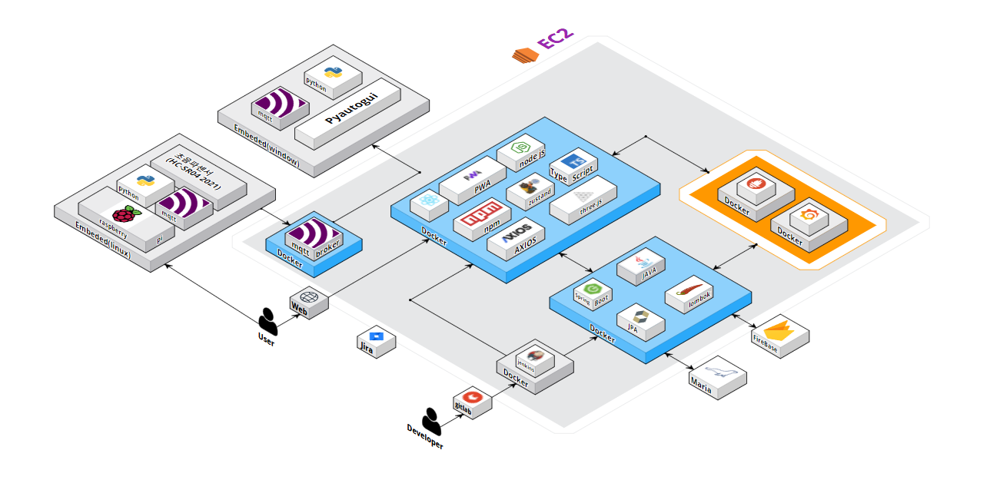
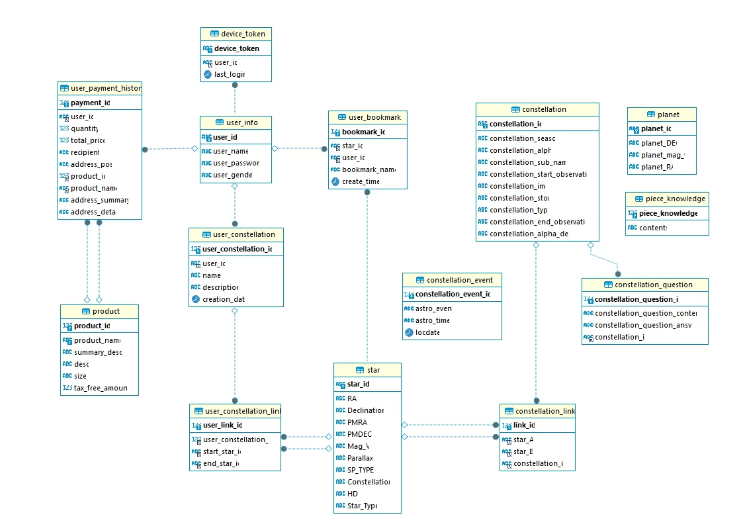

# 🌟 StellAR : 밤하늘의 빛나는 저 하늘의 별 🔭

> ### **증강현실(AR)과 3D 맵을 활용한 별자리 앱 서비스**  
>
>  
> **StellAR**는 아이들이 우주에 대한 관심을 높일 수 있도록 설계된 어플리케이션입니다. 빛 공해로 인해 보이지 않는 별들을 휴대폰과 스크린을 통해 생생하게 볼 수 있으며, 별자리들을 직접 만들어보는 체험을 제공합니다. **StellAR**를 통해 아이들은 우주의 신비를 탐험하며 흥미와 호기심을 키울 수 있습니다.

## 주요 기능

- 어플리케이션 : AR모드와 3D모드를 통해 현재 위치 기반 별을 관측 가능, 별마크, 나만의 별자리 생성
- 에어터치 스크린 : 스크린을 통해 넓은 화면에서 별자리를 터치하고 별자리에 대한 정보 조회 가능

## 세부기능

| 구분 | 기능                                            | 설명                                                                                                 | 비고 |
| :--- | :---------------------------------------------- | :--------------------------------------------------------------------------------------------------- | :--- |
| 1    | 현재 위치 기반 별자리 관측                      | AR모드와 3D모드로 구분, GPS를 통해 현재 위치 기반 관측                                               |      |
| 2    | 날짜/시간에 맞는 밤 하늘 구현                   | 날짜 및 시간 수정 가능, 변경 사항에 맞춰 별, 행성 위치 변경                                          |      |
| 3    | 타임랩스                                        | 타임랩스를 통한 밤하늘 이동 변화 확인 기능                                                           |      |
| 4    | 나만의 별자리 만들기                            | 별 2개 이상 선택 시 별자리 생성 기능 활성화, 나만의 별자리 등록                                      |      |
| 5    | 별자리 관련 신화 및 과학 정보 제공              | 별자리 관련 정보를 카드 형식으로 제공, 간단한 OX문제를 통해 아이들이 쉽게 신화에 대해 공부할 수 있음 |      |
| 6    | 천문학적 이벤트 알림 기능                       | 천문학 이벤트 제공 및 다가오는 일정에 맞춰 푸시 알림 제공                                            |      |
| 7    | 상호작용이 가능한 별자리 비접촉 에어터치 스크린 | 빔프로젝트를 통해 3D 우주 맵을 출력하고 터치로 화면 조작(사이즈: 가로 100cm \* 세로 70cm)            |      |
| 8    | 배경음악                                        | StellAR 사용에 더욱 몰입하기위한 몽환적인 배경음악 재생 가능                                         |      |

## 목차

- [🌟 StellAR : 밤하늘의 빛나는 저 하늘의 별 🔭](#-stellar--밤하늘의-빛나는-저-하늘의-별-)
  - [주요 기능](#주요-기능)
  - [세부기능](#세부기능)
  - [목차](#목차)
  - [프로젝트 개괄](#프로젝트-개괄)
  - [설치 및 개발 설정](#설치-및-개발-설정)
  - [대표 기술](#대표-기술)
    - [Frontend](#frontend)
    - [Backend](#backend)
    - [Embedded](#embedded)
    - [Common](#common)
  - [프로젝트 시나리오](#프로젝트-시나리오)
    - [3d 맵 천체 구현](#3d-맵-천체-구현)
    - [날씨 및 시간 조정 타임랩스](#날씨-및-시간-조정-타임랩스)
    - [황도13궁 별자리 정보](#황도13궁-별자리-정보)
    - [별마크](#별마크)
    - [나만의 별자리](#나만의-별자리)
    - [교육용 에어 터치 스크린 구매](#교육용-에어-터치-스크린-구매)
  - [아키텍처](#아키텍처)
  - [E-R 다이어그램](#e-r-다이어그램)

## 프로젝트 개괄

- 일정 : 2023-04-10 ~ 2023-05-19 (총 6주)
- 인원 (총 6명)
  - Frontend 2
  - Backend 2
  - Embedded 2

## 설치 및 개발 설정

포팅메뉴얼 페이지와 연결 예정

## 대표 기술

### Frontend

1. Raycasting 기법을 통한 3D 맵 화면 이동

   - 카메라 위치가 구 형태의 맵 중앙을 중심으로 자연스럽게 이동하도록 구현

2. 비디오 스트림과 자이로 센서를 이용한 AR 구현

   - 디스플레이에 따른 비디오 스트리밍 화면 생성 및 기기의 움직임에 따른 화면 이동

3. GLTF 모델을 사용한 고도의 객체 표현

   - GLTF 형식의 3D 모델을 객체에 적용, 입체감 및 사실감 확보

4. Camera Positioning을 이용한 Zoom in/out 기능

   - 객체 클릭 시 카메라 위치 및 타겟 좌표를 변경하여 줌인/줌아웃 구현

5. ESLint를 통한 코드 규칙 정의 및 문제 식별
   - Javascript 및 Typescript 코드 규칙 정의, 로드
   - 코드에서 발견되는 문제시되는 패턴들을 식별

### Backend

1. 스케쥴러를 이용한 행성 정보 및 천문학적 이벤트 데이터 자동 갱신

   - 주기적으로 행성의 위치와 천문학적 이벤트를 자동으로 갱신
   - TaskScheduler를 사용하여 푸시 알림 스케줄링을 예약하여 리소스를 효율적으로 관리

2. BDD 방식의 테스트코드 작성
   - 각 계층별로 Given, When, Then 방식으로 단위 테스트
   - 실제 서비스가 자연스럽게 작동되는지 통합 테스트
   - 유지보수의 용이성과 코드의 안정성을 향상

### Embedded

1. 초음파 센서를 이용한 비접촉 에어 터치스크린 구현
   - 라즈베리파이의 초음파센서 처리 thread를 구현하여 독립적 trigger 발생 및 거리 계산 구현
   - 대용량 트래픽을 위한 mqtt broker를 기반으로 사용자 손동작에 대한 메세지 전송

### Common

1. 카르테시안 좌표계(지평좌표계)와 호도법을 적용한 3D 우주 맵 구현

   - 예일 밝은 별 목록 기반 실제 별 위치 파악 및 색상/겉보기 등급별 구현
   - 방위각과 고도를 라디안 단위로 변환하고 호도법을 활용하여 x, y, z 좌표 값 추출

2. min-max Scaling을 통한 원근감 구현

   - 별의 실제 위치 값을 기반으로 스케일링 된 x, y, z값을 적용

3. 분석도구 활용
   - SonarQube를 활용하여 정적 코드 분석으로 자동 리뷰 수행 및 지속적인 코드 품질 검사

## 프로젝트 시나리오

### 3d 맵 천체 구현

- 별/행성 실제 위치 x, y, z 값을 계산하여 배치
- 사용자 GPS 기반, 현 위치의 하늘 구현
- 3D모드/자이로 모드/AR모드 제공

### 날씨 및 시간 조정 타임랩스

- 원하는 날짜와 시간의 실제 하늘의 별 위치
- 5분 단위로 별의 이동 타임랩스

### 황도13궁 별자리 정보

- 과학 정보 (관측 시기, 알파별)
- 신화 퀴즈
- 신화 이야기

### 별마크

- 원하는 별의 위치와 별칭을 저장
- 저장된 별의 위치로 이동

### 나만의 별자리

- 실제 별을 이어서 밤하늘에 3d 별자리 생성 및 기록
- 저장된 별자리의 위치로 이동

### 교육용 에어 터치 스크린 구매

- 교육용 에어 터치 스크린 카카오페이로 구매

## 아키텍처

## E-R 다이어그램

